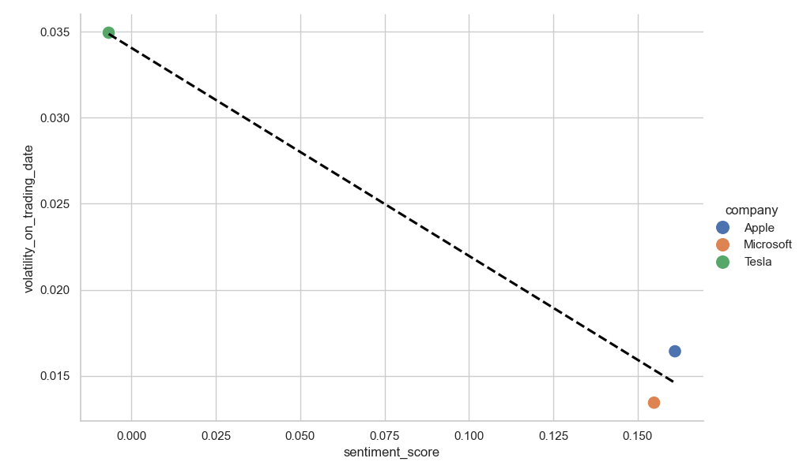

# FinTech Project: Correlating Financial News Sentiment with Stock Volatility

[](https://www.python.org/downloads/release/python-3100/) 
**Author:** **Sourabh Sonker (Aspiring Data Scientist)**

## Table of Contents
- [Project Overview](#project-overview)
- [Business Problem](#business-problem)
- [Key Features](#key-features)
- [Methodology](#methodology)
- [Results and Findings](#results-and-findings)
- [Challenges and Problem-Solving](#challenges-and-problem-solving)
- [Limitations and Future Work](#limitations-and-future-work)
- [Technologies Used](#technologies-used)
- [How to Run This Project](#how-to-run-this-project)

---

## Project Overview

This project is an end-to-end data science pipeline that investigates the relationship between financial news sentiment and stock market volatility. The script automatically fetches recent news headlines and stock price data for a predefined set of companies (Apple, Microsoft, and Tesla), performs sentiment analysis on the news, calculates price volatility, and runs a correlation analysis to uncover potential relationships.

The primary goal was not only to answer a financial question but also to build a robust, real-world data pipeline that handles common challenges like API integration, data cleaning, and logical inconsistencies.



---

## Business Problem

In the fast-paced world of financial markets, traders and risk managers are constantly seeking an edge to anticipate significant price swings (volatility). This project addresses a key business question:

> **"Can the sentiment of daily financial news be used as an indicator for same-day stock price volatility?"**

The hypothesis is that days with more negative news sentiment will correlate with higher market uncertainty, leading to increased stock price volatility. This project serves as a proof-of-concept to validate this hypothesis using publicly available data.

---

## Key Features

*   **Automated Data Pipeline:** Single-script execution that handles data fetching, cleaning, analysis, and visualization.
*   **Dual API Integration:** Pulls news data from **NewsAPI** and financial market data from **yfinance**.
*   **Natural Language Processing (NLP):** Employs the **VADER** sentiment analysis library to quantify the emotional tone of news headlines.
*   **Robust Date Handling:** Implements custom logic to map news dates (including weekends/holidays) to their corresponding valid trading days.
*   **Dynamic Analysis:** The project analyzes the most recent data available, making the process easily repeatable for different timeframes.

---

## Methodology

The project follows a systematic 6-step process:

1.  **Configuration:** Defines the target stocks (AAPL, MSFT, TSLA), API keys, and analysis timeframe. A key adaptation was to shift the analysis window back several days from the current date to ensure all necessary data was available.
2.  **News Fetching:** Retrieves recent news headlines from NewsAPI using a robust query that includes both company names and stock tickers.
3.  **Sentiment Analysis:**
    *   Loads the raw news data into a pandas DataFrame.
    *   Calculates a `sentiment_score` for each headline using VADER's compound score (ranging from -1 for most negative to +1 for most positive).
    *   Aggregates these scores to produce a single average daily sentiment score for each company.
4.  **Stock Data Processing:**
    *   Downloads historical stock data from `yfinance`.
    *   Cleans and structures the data, standardizing column names to prevent errors.
    *   Calculates daily `volatility` as `(High - Low) / Low`.
5.  **Data Merging:**
    *   This critical step maps the date of each news article to its corresponding trading day. For example, news from a Friday, Saturday, or Sunday is mapped to the following Monday's trading session.
    *   Merges the sentiment scores with the volatility data for that trading day into a final, analysis-ready DataFrame.
6.  **Analysis & Visualization:**
    *   Calculates the Pearson correlation coefficient between the sentiment scores and volatility.
    *   Generates a scatter plot using Seaborn and Matplotlib to visually represent the relationship, with data points colored by company.

---

## Results and Findings

For the analyzed period, the project found a **strong negative correlation** between the average sentiment score and same-day stock volatility.

*   **Quantitative Result:** The Pearson correlation coefficient was **-0.987**.
*   **Qualitative Result:** As illustrated in the plot, Tesla, which had a negative sentiment score, exhibited the highest volatility. Conversely, Apple and Microsoft both had positive sentiment scores and experienced significantly lower volatility.

This result supports the initial hypothesis that negative news sentiment is associated with higher market uncertainty and price swings.

---

## Challenges and Problem-Solving

This project's true value lies in the real-world challenges encountered and overcome. This demonstrates a practical understanding of the iterative nature of data science.

*   **API Limitations:** Initially, the project aimed for a 30-day analysis. However, it was discovered that the NewsAPI free plan returned very few relevant articles for such a broad query. **Solution:** The project was adapted to a shorter, high-frequency timeframe where data was more reliably available.
*   **Data Integrity (`KeyError`):** The `yfinance` library returned inconsistent column names (e.g., `'Adj Close'` vs. `'adj close'`). **Solution:** Implemented a robust data cleaning step to standardize all column names to lowercase, preventing key errors.
*   **Date Logic (`Empty DataFrame`):** The most significant challenge was that the final merged DataFrame was empty. Through systematic debugging, I identified that news from the last available day (e.g., a Friday) had no "next day" in the dataset to merge with. **Solution:** I re-engineered the date logic, shifting the entire analysis window back a few days and mapping news dates to the *same or next available* trading day, which solved the issue entirely.
*   **Data Type Mismatch (`ValueError`):** The merge operation failed due to one DataFrame storing dates as `datetime` objects and the other as `string` objects. **Solution:** Explicitly cast the key columns in both DataFrames to the `datetime` data type immediately before merging to ensure consistency.

---

## Limitations and Future Work

While this project successfully demonstrates a working pipeline and an interesting correlation, it is important to acknowledge its limitations:

*   **Sample Size:** The strong correlation is based on a very small number of data points. This result serves as a proof-of-concept and cannot be reliably generalized without more data.
*   **Causation vs. Correlation:** This analysis shows a correlation, not a causal link. Many other factors influence stock volatility.

**Future enhancements could include:**
*   Integrating a premium news API to build a dataset spanning several years.
*   Expanding the analysis to include a wider range of stocks and market sectors.
*   Using more advanced NLP models (like FinBERT) specifically trained on financial language for more nuanced sentiment analysis.

---

## Technologies Used

*   **Language:** Python
*   **Libraries:**
    *   **Data Manipulation:** Pandas, NumPy
    *   **API Interaction:** Requests, yfinance
    *   **NLP/Sentiment Analysis:** VADER (vaderSentiment)
    *   **Data Visualization:** Matplotlib, Seaborn

---

## How to Run This Project

1.  **Clone the repository:**
    ```bash
    git clone [Your-GitHub-Repo-URL]
    cd [repository-folder]
    ```

2.  **Install the required libraries:**
    ```bash
    pip install pandas requests yfinance vaderSentiment matplotlib seaborn
    ```

3.  **Set up your API key:**
    *   Open the `fintech_project.py` file.
    *   Find the line `NEWS_API_KEY = "YOUR_NEWS_API_KEY"`.
    *   Replace `"YOUR_NEWS_API_KEY"` with your actual key obtained from [NewsAPI.org](https://newsapi.org/).

4.  **Run the script:**
    ```bash
    python fintech_project.py
    ```

5.  **Check the output:**
    *   The script will print its progress to the console.
    *   A new folder named `project_data` will be created.
    *   The final correlation plot, `sentiment_vs_volatility.png`, will be saved in the `project_data` folder.
